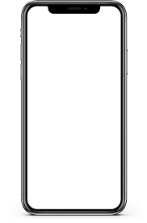

<!doctype html>
<html lang="en" data-bs-theme="auto">
  <head>

    <meta charset="utf-8">
    <meta name="viewport" content="width=device-width, initial-scale=1">
    <title>konter hp siddiq.si heker bejorka,</title>/title>
    <link rel="stylesheet" href="https://cdn.jsdelivr.net/npm/@docsearch/css@3">
<link href="https://cdn.jsdelivr.net/npm/bootstrap@5.3.3/dist/css/bootstrap.min.css" rel="stylesheet">
    

    
    <!-- Custom styles for this template -->
    <link href="product.css" rel="stylesheet">
  </head>
  <body>
    

    

      <button class="btn btn-bd-primary py-2 dropdown-toggle d-flex align-items-center"
              id="bd-theme"
              type="button"
              aria-expanded="false"
              data-bs-toggle="dropdown"
              aria-label="Toggle theme (auto)">
        <svg class="bi my-1 theme-icon-active" width="1em" height="1em"><use href="#circle-half"></use></svg>
        Toggle theme
      </button>
      <ul class="dropdown-menu dropdown-menu-end shadow" aria-labelledby="bd-theme-text">
        <li>
          <button type="button" class="dropdown-item d-flex align-items-center" data-bs-theme-value="light" aria-pressed="false">
            <svg class="bi me-2 opacity-50" width="1em" height="1em"><use href="#sun-fill"></use></svg>
            Light
            <svg class="bi ms-auto d-none" width="1em" height="1em"><use href="#check2"></use></svg>
          </button>
        </li>
        <li>
          <button type="button" class="dropdown-item d-flex align-items-center" data-bs-theme-value="dark" aria-pressed="false">
            <svg class="bi me-2 opacity-50" width="1em" height="1em"><use href="#moon-stars-fill"></use></svg>
            Dark
            <svg class="bi ms-auto d-none" width="1em" height="1em"><use href="#check2"></use></svg>
          </button>
        </li>
        <li>
          <button type="button" class="dropdown-item d-flex align-items-center active" data-bs-theme-value="auto" aria-pressed="true">
            <svg class="bi me-2 opacity-50" width="1em" height="1em"><use href="#circle-half"></use></svg>
            Auto
            <svg class="bi ms-auto d-none" width="1em" height="1em"><use href="#check2"></use></svg>
          </button>
        </li>
      </ul>
    

    
<svg xmlns="http://www.w3.org/2000/svg" class="d-none">
  <symbol id="aperture" fill="none" stroke="currentColor" stroke-linecap="round" stroke-linejoin="round" stroke-width="2" viewBox="0 0 24 24">
    <circle cx="12" cy="12" r="10"/>
    <path d="M14.31 8l5.74 9.94M9.69 8h11.48M7.38 12l5.74-9.94M9.69 16L3.95 6.06M14.31 16H2.83m13.79-4l-5.74 9.94"/>
  </symbol>
  <symbol id="cart" viewBox="0 0 16 16">
    <path d="M0 1.5A.5.5 0 0 1 .5 1H2a.5.5 0 0 1 .485.379L2.89 3H14.5a.5.5 0 0 1 .49.598l-1 5a.5.5 0 0 1-.465.401l-9.397.472L4.415 11H13a.5.5 0 0 1 0 1H4a.5.5 0 0 1-.491-.408L2.01 3.607 1.61 2H.5a.5.5 0 0 1-.5-.5zM3.102 4l.84 4.479 9.144-.459L13.89 4H3.102zM5 12a2 2 0 1 0 0 4 2 2 0 0 0 0-4zm7 0a2 2 0 1 0 0 4 2 2 0 0 0 0-4zm-7 1a1 1 0 1 1 0 2 1 1 0 0 1 0-2zm7 0a1 1 0 1 1 0 2 1 1 0 0 1 0-2z"/>
  </symbol>
  <symbol id="chevron-right" viewBox="0 0 16 16">
    <path fill-rule="evenodd" d="M4.646 1.646a.5.5 0 0 1 .708 0l6 6a.5.5 0 0 1 0 .708l-6 6a.5.5 0 0 1-.708-.708L10.293 8 4.646 2.354a.5.5 0 0 1 0-.708z"/>
  </symbol>
</svg>

<nav class="navbar navbar-expand-md bg-dark sticky-top border-bottom" data-bs-theme="dark">
  

    <a class="navbar-brand d-md-none" href="#">
      <svg class="bi" width="24" height="24"><use xlink:href="#aperture"/></svg>
      Aperture
    </a>
    <button class="navbar-toggler" type="button" data-bs-toggle="offcanvas" data-bs-target="#offcanvas" aria-controls="offcanvas" aria-label="Toggle navigation">
      
    </button>
    

      

        <h5 class="offcanvas-title" id="offcanvasLabel">Aperture</h5>
        <button type="button" class="btn-close" data-bs-dismiss="offcanvas" aria-label="Close"></button>
      

      

        <ul class="navbar-nav flex-grow-1 justify-content-between">
          <li class="nav-item"><a class="nav-link" href="#">
            <svg class="bi" width="24" height="24"><use xlink:href="#aperture"/></svg>
          </a></li>
          <li class="nav-item"><a class="nav-link" href="#">Tour</a></li>
          <li class="nav-item"><a class="nav-link" href="#">Product</a></li>
          <li class="nav-item"><a class="nav-link" href="#">Features</a></li>
          <li class="nav-item"><a class="nav-link" href="#">Enterprise</a></li>
          <li class="nav-item"><a class="nav-link" href="#">Support</a></li>
          <li class="nav-item"><a class="nav-link" href="#">Pricing</a></li>
          <li class="nav-item"><a class="nav-link" href="#">
            <svg class="bi" width="24" height="24"><use xlink:href="#cart"/></svg>
          </a></li>
        </ul>
      

    

  

</nav>

<main>
  

    

      <h1 class="display-3 fw-bold">siddiq conter terpercaya</h1>
      <h3 class="fw-normal text-muted mb-3">konter termurah dan terlengkap di bali.tepercaya aman sejatra sejak 2023</h3>
      

        <a class="icon-link" href="#"
          <svg class="bi"><use xlink:href="#chevron-right"/></svg>
        </a>
      

    

    
  

    

      

        <h2 class="display-5">iphone 14 pro</h2>
        
pre order iphone 14 pro sekarang juga

        
    

    

    

      

        <h2 class="display-5">iphone 14 pro max</h2>
        
jadilah customer pertama yang memiliki pro max

      

      

    

  

  

    

      

        <h2 class="display-5">samsung galaxy s25 ultra</h2>
        
order sekarang produk sepesial dari samsung 

      

      

    

    

      

        <h2 class="display-5">asus Rog phone8 </h2>
        
cocok untuk kamu yang suka geming 

      

      

    

  

  

    

      

        <h2 class="display-5">nubia redmegic8 pro</h2>
        
hp geming yang gak ada tandinganya performance turbo

      

      

   v>
    

      

        <h2 class="display-5">googel pixsel 9pro xl</h2>
        
hp yang mirip seperti buah-buahan cocok buat yang suka foto-foto

      

      

    

  

  

    

      

        <h2 class="display-5">tekno pova 6pro</h2>
        
hp geming murah cuma bajet 2jt an boleh bawa puan

      

      

    

    

      

        <h2 class="display-5">itel s25 ultra</h2>
        
hp plagiat yang mempunyai layar lengkung yanng sangat elegan

      

      

    

  

</main> </di

<footer class="container py-5">
  

    

      <svg xmlns="http://www.w3.org/2000/svg" width="24" height="24" fill="none" stroke="currentColor" stroke-linecap="round" stroke-linejoin="round" stroke-width="2" class="d-block mb-2" role="img" viewBox="0 0 24 24"><title>Product</title><circle cx="12" cy="12" r="10"/><path d="M14.31 8l5.74 9.94M9.69 8h11.48M7.38 12l5.74-9.94M9.69 16L3.95 6.06M14.31 16H2.83m13.79-4l-5.74 9.94"/></svg>
      <small class="d-block mb-3 text-body-secondary">&copy; 2024–2025</small>
    

    

      <h5>sosial media</h5>
      <ul class="list-unstyled text-small">
        <li><a class="link-secondary text-decoration-none" href="#">instaggram</a></li>
        <li><a class="link-secondary text-decoration-none" href="#">facbook</a></li>
        <li><a class="link-secondary text-decoration-none" href="#">youtube</a></li>
        <li><a class="link-secondary text-decoration-none" href="#">twiter</a></li>
        
      </ul>
    

    

      <ul class="list-unstyled text-small">
      <ul class="list-unstyled text-small">
        <h5>pelayanan</h5>
      <ul class="list-unstyled text-small">
        <li><a class="link-secondary text-decoration-none" href="#">pelayanan</a></li>
        <li><a class="link-secondary text-decoration-none" href="#">live chat</a></li>
        <li><a class="link-secondary text-decoration-none" href="#">call canter</a></li>
        <li><a class="link-secondary text-decoration-none" href="#">settings</a></li>
      </ul>
    

   
    

      <h5>tentang</h5>
      <ul class="list-unstyled text-small">
        <li><a class="link-secondary text-decoration-none" href="#">088987228330</a></li>
        <li><a class="link-secondary text-decoration-none" href="#">jembrana</a></li>
        <li><a class="link-secondary text-decoration-none" href="#">Pivas</a></li>
        <li><a class="link-secondary text-decoration-none" href="#">Terms</a></li>
      </ul>
    

  

</footer>

    </body>
</html>
